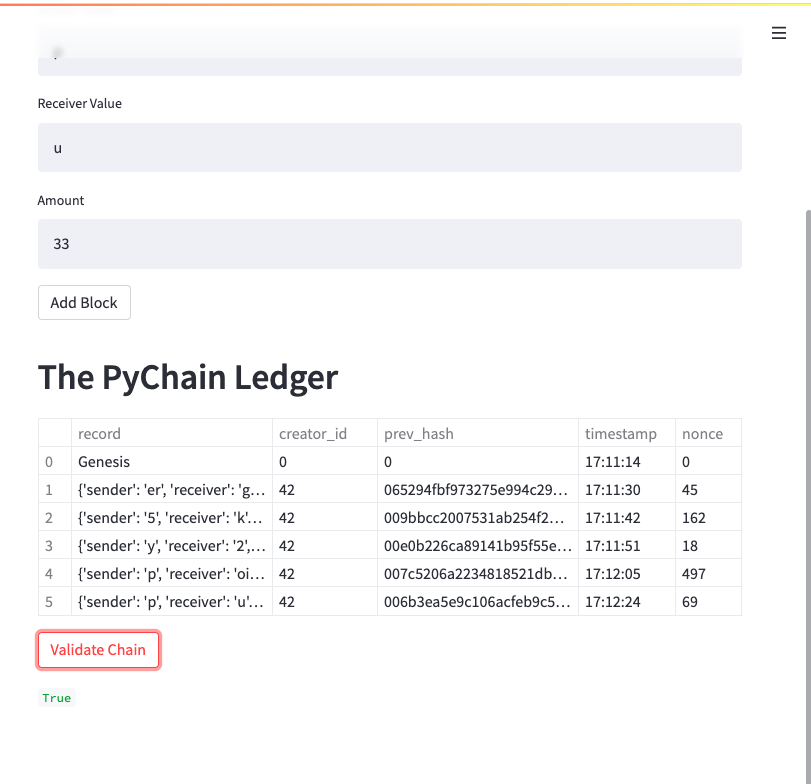

# Challenge18
## Overview
This challenge involves building a blockchain-based ledger system, complete with a user-friendly web interface. This ledger should allow partner banks to conduct financial transactions (that is, to transfer money between senders and receivers) and to verify the integrity of the data in the ledger.

## The Results

The python blockchain code was modified to accomodate a record class entailing sender, receiver, and amount data fields. Streamlit was used to create the web interface. Pictures of the user input dropdown saved to blockchain and the validated chain are shown below:

Dropdown

Validation

## Summary
The blockchain code was modified to accept a record class for user input and successfully launched and validated on a web interface using streamlit.